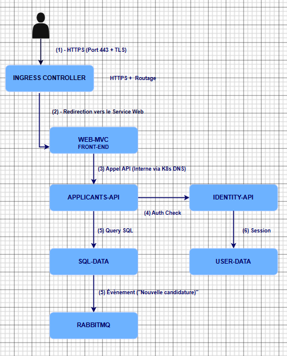

# Projet M2Cloud – Déploiement Kubernetes d’une architecture microservices

## Description

Ce projet consiste à déployer une architecture microservices dans un environnement Kubernetes afin de garantir :

- Haute disponibilité
- Scalabilité automatique
- Monitoring du cluster
- Centralisation des logs
- Sécurité réseau
- Déploiement automatisé

L'application est déployée sur Kubernetes et automatisée avec Helm.

Le projet a été testé sur Kubernetes Docker Desktop (cluster local).

---

# Architecture applicative

## Documentation d'architecture

📄 [Voir l'architecture complète (PDF)](architecture.drawio.pdf)

## Workflow utilisateur

Le schéma ci-dessous représente le parcours d'une requête utilisateur dans l'application :

<p align="center">
  
</p>

L'application contient les microservices suivants :

| Service | Description |
|-----------|-------------|
| webmvc | Frontend Web |
| applicants.api | Gestion des candidats |
| jobs.api | Gestion des offres |
| identity.api | Gestion authentification |
| sql.data | Base SQL Server |
| user.data | Redis |
| rabbitmq | Communication entre services |
| prometheus | Monitoring |
| grafana | Dashboards métriques |
| elasticsearch | Stockage des logs |
| fluent-bit | Collecte des logs |
| kibana | Visualisation des logs |

---

## Relations entre services

```txt
webmvc
├── applicants.api
├── jobs.api
└── identity.api

applicants.api
├── sql.data
└── rabbitmq

jobs.api
├── sql.data
└── rabbitmq

identity.api
├── user.data
└── rabbitmq

Prometheus
├── webmvc
├── applicants.api
├── jobs.api
└── identity.api

Fluent-bit
└── collecte les logs de tous les pods
```

---

# Architecture Kubernetes

Namespaces utilisés :

| Namespace | Description |
|------------|-------------|
| projet-apps | Applications |
| ns-data | Bases de données et messaging |
| ns-monitoring | Monitoring et logs |
| ingress-nginx | Contrôleur ingress |

---

# Technologies utilisées

## Conteneurisation

- Docker
- Docker Hub

## Orchestration

- Kubernetes
- Helm

## Monitoring

- Prometheus
- Grafana
- Metrics Server
- kube-state-metrics

## Logs

- Elasticsearch
- Fluent-bit
- Kibana

## Sécurité

- ServiceAccount
- RBAC
- NetworkPolicy
- TLS

---

# Structure du dépôt

```txt
.
├── Database/
├── Services/
├── Web/
├── k8s/
├── logging/
├── test-helm/
├── AUTHORS.TXT
├── docker-compose.yml
├── README.md
├── all.ps1
```

Description :

| Dossier | Description |
|-----------|-------------|
| Database | SQL Server |
| Services | APIs |
| Web | Frontend |
| k8s | Manifests Kubernetes |
| logging | Stack EFK |
| test-helm | Chart Helm |
| AUTHORS.TXT | Membres du groupe |
| all.ps1 | Script automatisation |

---

# Ports et dépendances

## Services applicatifs

| Service | Port conteneur | Port local | Dépendances |
|-----------|--------------|------------|-------------|
| webmvc | 80 | 8080 | applicants.api jobs.api identity.api |
| applicants.api | 80 | 8081 | sql.data rabbitmq |
| jobs.api | 80 | 8083 | sql.data rabbitmq |
| identity.api | 80 | 8084 | user.data rabbitmq |

## Services données

| Service | Port |
|-----------|-------|
| SQL Server | 1433 |
| Redis | 6379 |
| RabbitMQ | 5672 |
| RabbitMQ UI | 15672 |

## Monitoring

| Service | Port |
|-----------|------|
| Prometheus | 9090 |
| Grafana | 3000 |
| Elasticsearch | 9200 |
| Kibana | 5601 |

---

# Build des images Docker

Exemples :

```bash
docker build -t webmvc -f Web/Dockerfile .
docker build -t applicants-api -f Services/Applicants.Api/Dockerfile .
docker build -t jobs-api -f Services/Jobs.Api/Dockerfile .
docker build -t identity-api -f Services/Identity.Api/Dockerfile .
docker build -t sql-data -f Database/Dockerfile ./Database
```

Push Docker Hub :

```bash
docker tag webmvc username/webmvc:v1
docker push username/webmvc:v1
```

---

# Déploiement Kubernetes classique

Déploiement manuel :

```bash
kubectl apply -f k8s/
kubectl apply -f logging/
```

Vérifier :

```bash
kubectl get pods -A
kubectl get svc -A
```

---

# Déploiement Helm

Positionnement :

```bash
cd test-helm
```

Vérifier le chart :

```bash
helm lint .
```

Générer les manifests :

```bash
helm template k8s . -n projet-apps > rendered.yaml
```

Déployer :

```bash
helm upgrade --install k8s . \
--namespace projet-apps \
--create-namespace
```

Vérifier :

```bash
helm list -A
```

---

# Vérification du cluster

Afficher tous les pods :

```bash
kubectl get pods -A
```

Afficher les services :

```bash
kubectl get svc -A
```

Afficher les ingress :

```bash
kubectl get ingress -A
```

Afficher les ressources :

```bash
kubectl top pods -A
kubectl top nodes
```

Afficher les événements :

```bash
kubectl get events -A
```

Afficher les logs :

```bash
kubectl logs <pod> -n <namespace>
```

---

# Monitoring

Le monitoring est assuré par :

- Metrics Server
- Prometheus
- Grafana
- kube-state-metrics

Vérification :

```bash
kubectl get pods -n ns-monitoring
```

---

# Gestion des logs

Stack utilisée :

- Elasticsearch
- Fluent-bit
- Kibana

Vérification :

```bash
kubectl logs daemonset/fluent-bit -n ns-monitoring
```

---

# HPA

Le projet implémente un Horizontal Pod Autoscaler basé sur la consommation CPU.

Vérification :

```bash
kubectl get hpa -A
```

---

# Sécurité

Éléments implémentés :

- ServiceAccount dédié
- RBAC
- NetworkPolicy
- HTTPS via Ingress
- Certificat auto-signé TLS

Vérification :

```bash
kubectl get serviceaccount -A
kubectl get role -A
kubectl get rolebinding -A
kubectl get networkpolicy -A
```

---

# Accès aux interfaces

| Service | URL |
|-----------|-----|
| Frontend Web | https://localhost |
| Grafana | http://localhost:3000 |
| Prometheus | http://localhost:9090 |
| Kibana | http://localhost:5601 |
| RabbitMQ | http://localhost:15672 |

Identifiants :

### Grafana

```txt
admin
admin
```

### RabbitMQ

```txt
guest
guest
```

---

# Nettoyage

Supprimer le déploiement :

```bash
helm uninstall k8s -n projet-apps
```

Supprimer les namespaces :

```bash
kubectl delete namespace projet-apps
kubectl delete namespace ns-data
kubectl delete namespace ns-monitoring
```

---

# Limites connues

Le projet a été réalisé et testé sur Kubernetes Docker Desktop :

- cluster local single-node
- ressources limitées
- certains composants monitoring nécessitent beaucoup de RAM

Dans un environnement AKS multi-nœuds, la haute disponibilité serait pleinement exploitée.

---

### Matrice des flux applicatifs de JobServer

| Source | Destination | Fonction du flux |
|---|---|---|
| Utilisateur externe | webmvc | Accès HTTPS à l’application via l’Ingress |
| webmvc | applicants.api | Consultation et gestion des candidatures |
| webmvc | jobs.api | Consultation des offres d’emploi |
| webmvc | identity.api | Authentification des utilisateurs |
| applicants.api | sql.data | Accès aux données des candidatures |
| applicants.api | rabbitmq | Échanges entre services |
| jobs.api | sql.data | Accès aux données des offres |
| jobs.api | rabbitmq | Échanges entre services |
| identity.api | user.data | Accès aux données d’authentification |
| identity.api | rabbitmq | Échanges entre services |
| Prometheus | Services supervisés | Collecte des métriques |
| Fluent Bit | Pods du cluster | Collecte des logs |
| Kibana | Elasticsearch | Consultation et recherche dans les logs |
| Grafana | Prometheus | Visualisation des métriques |

## Annexe 7 – Organisation des équipes JobServer et prestataire

Cette annexe précise la répartition des rôles entre JobServer, en tant que client, et l’équipe prestataire chargée de la migration et de la phase de stabilisation de l’infrastructure Kubernetes.

## Annexe 7 – Organisation des équipes JobServer et prestataire

Cette annexe précise la répartition des rôles entre JobServer, en tant que client, et l’équipe prestataire chargée de la migration et de la phase de stabilisation de l’infrastructure Kubernetes.

| Organisation | Persona | Fonction | Objectif principal | Rôle en cas d’incident |
|---|---|---|---|---|
| JobServer | Claire Martin | Responsable métier / Commanditaire | Garantir la disponibilité du service pour les candidats et les recruteurs | Évalue l’impact métier et valide le retour au fonctionnement normal |
| JobServer | Lucas Bernard | Développeur référent | Maintenir le bon fonctionnement des microservices | Analyse et corrige les anomalies liées au code ou au comportement applicatif |
| Prestataire | Iptissem Zitouni | Cheffe de projet / Référente technique | Piloter la migration et assurer la phase de stabilisation | Qualifie l’incident, définit sa priorité, suit le FT et coordonne les différents intervenants |
| Prestataire | Mehdi Laurent | Ingénieur DevOps / Exploitation | Maintenir l’infrastructure Kubernetes opérationnelle | Analyse les incidents liés au cluster, aux pods, aux ressources, au réseau ou au déploiement |
| Prestataire | Sofia Robert | Référente sécurité | Garantir le respect des exigences de sécurité | Intervient sur les incidents liés aux accès, aux données ou à la sécurité du SI |

**Tableau A7.1 – Personae et responsabilités des équipes JobServer et prestataire**

Cette organisation me permet de ne pas traiter tous les incidents de la même manière. Je reste le point d’entrée pendant la phase de stabilisation, mais la résolution dépend ensuite de l’origine du problème. Un incident lié à Kubernetes ou au déploiement est pris en charge côté prestataire, tandis qu’une anomalie provenant du code d’un microservice est transmise à l’équipe de développement JobServer.

*Les noms utilisés pour les membres des équipes sont fictifs et servent uniquement à illustrer l’organisation retenue pour le projet.*

## Annexe 10 – Support de sensibilisation et documentation d’exploitation

Cette annexe présente les supports prévus pour accompagner l’équipe JobServer dans la prise en main de l’environnement Kubernetes après la phase de stabilisation. L’objectif est de faciliter les premières opérations de supervision, de diagnostic et de suivi des incidents.

### Annexe 10.1 – Fiche réflexe en cas d’incident

Lorsqu’une anomalie est détectée, l’équipe peut suivre les étapes suivantes :

| Étape | Action | Outil principal |
|---|---|---|
| 1. Détecter | Identifier l’alerte, le composant concerné et son niveau de criticité | Grafana |
| 2. Vérifier | Contrôler l’état des pods, services et ressources Kubernetes | kubectl / Metrics Server |
| 3. Diagnostiquer | Consulter les métriques, événements et logs associés au composant | Prometheus / Kibana |
| 4. Consigner | Vérifier ou compléter le fait technique créé dans Jira | Jira |
| 5. Qualifier | Déterminer si l’incident relève de l’infrastructure ou de l’application | Jira / Analyse technique |
| 6. Affecter | Transmettre le FT à l’interlocuteur compétent | Jira |
| 7. Corriger | Appliquer le correctif adapté au périmètre concerné | Kubernetes / Helm / Code applicatif |
| 8. Valider | Vérifier le retour du service, les métriques et l’absence de nouvelles erreurs | Grafana / Kibana / Kubernetes |
| 9. Clôturer | Documenter la cause, le correctif et les éventuelles actions préventives | Jira |

**Tableau A10.1 – Fiche réflexe de prise en charge d’un incident JobServer**

En cas d’incident critique, la priorité reste le rétablissement du service. L’analyse détaillée et le retour d’expérience sont complétés une fois l’environnement stabilisé.

### Annexe 10.2 – Support de passation à l’équipe JobServer

La passation doit permettre à l’équipe JobServer de devenir progressivement autonome sur les opérations courantes de maintien en condition opérationnelle.

| Thème | Compétence attendue après la passation | Support utilisé |
|---|---|---|
| Kubernetes | Vérifier l’état des pods et identifier un composant indisponible | Démonstration + fiche de commandes |
| Grafana | Lire un dashboard et identifier une alerte | Démonstration sur le dashboard JobServer |
| Prometheus | Consulter une métrique Kubernetes | Exemple de requêtes utilisées dans le projet |
| Kibana | Rechercher les logs d’un service ou une erreur | Démonstration à partir de l’incident webmvc |
| Jira | Consulter, qualifier et suivre un fait technique | Workflow des FT |
| Incidents | Distinguer un problème infrastructure d’un problème applicatif | Fiche réflexe |
| Escalade | Identifier l’interlocuteur à mobiliser selon la cause | Matrice des responsabilités |

**Tableau A10.2 – Contenu de la passation à l’équipe JobServer**

Je prévois une première présentation lors du transfert de l’environnement, puis des rappels en cas d’évolution importante ou lorsqu’un incident met en évidence un besoin de clarification.

Les supports sont conçus pour rester accessibles : structure simple, texte lisible, contraste suffisant, informations qui ne reposent pas uniquement sur la couleur et possibilité d’ajouter des sous-titres aux démonstrations enregistrées.

## Annexe 11 – Glossaire technique

Cette annexe présente les principaux termes techniques utilisés dans le cadre du maintien en condition opérationnelle de JobServer.

| Terme | Définition |
|---|---|
| MCO | Maintien en condition opérationnelle. Ensemble des actions permettant de conserver un SI disponible et exploitable dans le temps. |
| Pod | Plus petite unité déployable dans Kubernetes, contenant un ou plusieurs conteneurs. |
| Deployment | Ressource Kubernetes permettant de gérer le déploiement et le nombre attendu de pods. |
| Replica | Instance supplémentaire d’un même pod permettant d’augmenter la disponibilité ou la capacité du service. |
| HPA | Horizontal Pod Autoscaler. Mécanisme Kubernetes qui adapte automatiquement le nombre de replicas selon la charge. |
| Liveness Probe | Sonde permettant à Kubernetes de vérifier qu’un conteneur est toujours fonctionnel. |
| Readiness Probe | Sonde permettant de vérifier si un pod est prêt à recevoir du trafic. |
| Metrics Server | Composant Kubernetes fournissant notamment les métriques CPU et mémoire utilisées par `kubectl top` et le HPA. |
| kube-state-metrics | Composant exposant l’état des objets Kubernetes sous forme de métriques exploitables par Prometheus. |
| Prometheus | Outil de collecte et d’interrogation de métriques utilisé pour la supervision. |
| Grafana | Outil permettant de visualiser les métriques et de configurer des règles d’alerte. |
| EFK | Ensemble Elasticsearch, Fluent Bit et Kibana utilisé pour centraliser et consulter les logs. |
| Jira | Outil utilisé dans le projet pour consigner et suivre les faits techniques et incidents. |
| FT | Fait technique. Ticket permettant de tracer une anomalie, son analyse, son responsable et son traitement. |
| Helm | Gestionnaire de packages Kubernetes utilisé pour déployer et mettre à jour les composants du projet. |
| Ingress | Ressource Kubernetes permettant de gérer l’accès HTTP/HTTPS à une application depuis l’extérieur du cluster. |
| Namespace | Espace logique Kubernetes utilisé pour regrouper et séparer les ressources selon leur fonction. |

 values.yaml          Chart Helm            Helm                 Kubernetes
┌────────────┐      ┌────────────┐      ┌────────────┐      ┌─────────────────┐
│ paramètres │ ---> │ templates  │ ---> │ upgrade /  │ ---> │ projet-apps     │
│            │      │ K8s        │      │ install    │      │ ns-data         │
└────────────┘      └────────────┘      └────────────┘      │ monitoring...   │
                                                            └─────────────────┘

              Déploiement reproductible et versionné

# Membres du groupe

Voir :


```txt
AUTHORS.TXT
```
# CI automatic trigger test
